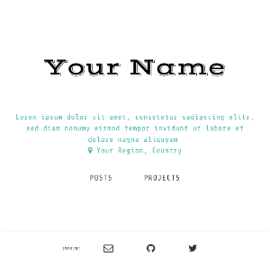

The [Jekyll](http://jekyllrb.com/) static site generator is a widely used tool, that powers also this website.
I have created two easy configurable and minimal themes. You can use them, how you want, they are open source on Github. Both licensed under MIT.

### 1. a fresh material based theme
  
[See the demo](http://himsel.me/material-theme/) or the [Github Project](https://github.com/lukas-h/material-theme)

### 2. single-page theme (used here)
This theme is only one html page, but with all the features, you would expect from a blog.  
[Github Project](https://github.com/lukas-h/onepage) 
